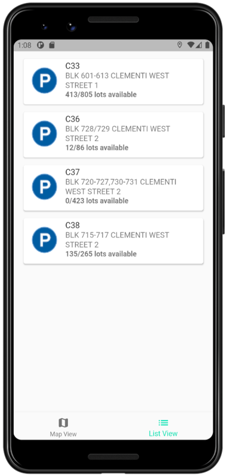

# Park Buddy

## Overview

Park Buddy is a mobile application intended to allow drivers a more convenient and frustration free parking experience. Settle your parking needs even before leaving your house! The application allows drivers to:

- View carparks near their current location
- Search for any destination and receive realtime search suggestions
- View carparks near their intended destination
- View the number of lots currently available in any carpark
- View the historic trend of hourly lot availabilities for any carpark on any day
- Navigate from their current location to their chosen carpark via Google Maps





## Getting Started

### Prerequisites

You will need the following to run the program:

- Flutter
- Android Studio
- Android Emulator/Android Device

### Installing and running

Clone this repo with:

```
git clone https://github.com/mohamedirfansh/Park-Buddy.git
```

#### To test and develop the app on your local machine do the following:

1. Head to the [Google Maps Platform ](https://developers.google.com/maps) to get your own API key.
2. Navigate to `/android/app/src/main` and open `AndroidManifest.xml`.
3. Go to `line 10` and replace `YOUR_API_KEY` with you own API key.

Ensure that you have either an emulator or an android device connected. Then run the following commands:

```
flutter pub get
flutter run
```

#### If you would just like to download and run the app on your phone, do the following:

After cloning the repo,

1. Copy `park-buddy.apk` from the root folder to your android phone.
2. Install the APK file and run it on your phone.

#### To view the code documentation do the following:

1. Navigate to `/doc/api` from the root folder.
2. Open `index.html` in your preferred browser.

## Built with

- [Flutter](https://flutter.dev/)
- [Google Maps API](https://developers.google.com/maps/documentation)
- [Google Places API](https://developers.google.com/maps/documentation/places/web-service/overview)
- [Carpark Availability API - data.gov.sg](https://data.gov.sg/dataset/carpark-availability)
- [HDB Carpark Dataset - data.gov.sg](https://data.gov.sg/dataset/hdb-carpark-information)
- [SQLite for Flutter](https://pub.dev/packages/sqflite)
- [Syncfusion Charts](https://pub.dev/packages/syncfusion_flutter_charts)

## Authors

- [Zachary Lee](https://github.com/zvarellalee)
- [Jireh Chew](https://github.com/jirehcwe)
- [Mohamed Irfan](https://github.com/mohamedirfansh)
- [Aneez Jaheezuddin](https://github.com/aneezJaheez)
- [Lionel Wong](https://github.com/lwong020)
- [Remus Neo](https://github.com/remusneokl)
